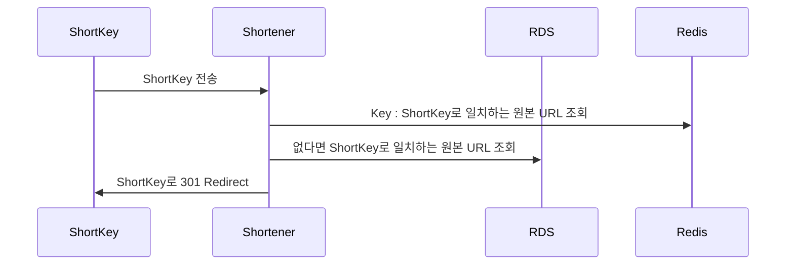

# 흐름도

## Create

```mermaid
sequenceDiagram
    participant user as 원본 URL
    participant shortener as Shortener
    participant rds as RDS
    participant redis as Redis
    user->>shortener: 원본 URL 전송
    shortener->>rds: 이미 생성된 ShortKey가 있는지 조회
    rds->>shortener: 원본 URL과 일치하는 ShortKey 응답
    shortener-->>rds: 없다면 Random Short URL 생성 + RDS에 중복되는게 있는지 확인
    shortener-->>rds: 랜덤 ShortKey + 원본 URL Entity 저장
    shortener-->>redis: Key : 원본 URL, Value : ShortKey 저장(Cache)
    shortener->>user: ShortKey 응답
```

## Read

```mermaid
sequenceDiagram
    participant user as ShortKey
    participant shortener as Shortener
    participant rds as RDS
    participant redis as Redis
    user->>shortener: ShortKey 전송
    shortener->>redis: Key : ShortKey로 일치하는 원본 URL 조회
    shortener->>rds: 없다면 ShortKey로 일치하는 원본 URL 조회
    shortener->>user: ShortKey로 301 Redirect
```
