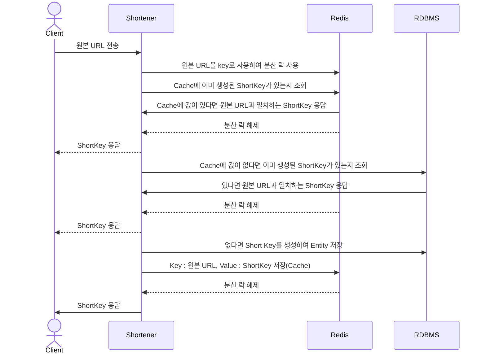
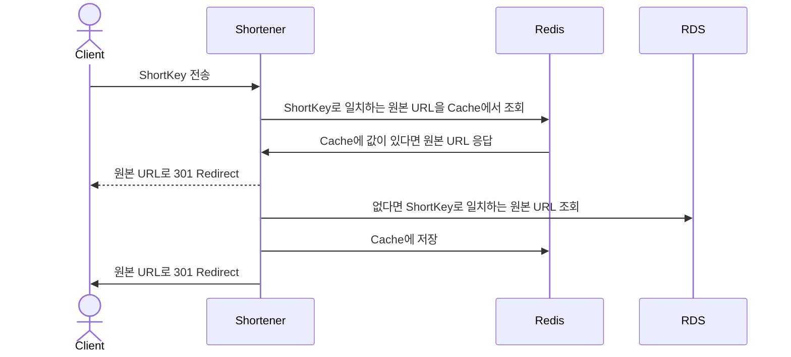

# 단축 URL 생성기 프로젝트

## 목차
- [How To Run](#how-to-run)
- [기능](#기능)
- [아키텍처 및 설계](#아키텍처-및-설계)
- [Short Key 생성 과정](#Short-Key-생성-과정)

## How to run
```
# redis server run 
docker-compose up -d

# spring boot application run
```

## 기능
1. 원본 url을 받아서 단축 url로 변환 합니다.
2. 단축 url을 받아서 원본 url로 Redirect 합니다.

## 아키텍처 및 설계

### Create
- 동시에 같은 원본 url을 맵핑 시켜달라는 요청이 올 수 있기 때문에 AOP를 활용한 redisson lock을 사용합니다.
- 성능을 위해 Read-Through Cache 전략을 사용하여 RDBMS의 부하를 줄입니다.


### Read



## Short Key 생성 과정

### 1. Snowflake key 생성

#### snowflake key 특징
- 분산 시스템에서 사용되는 고유 식별자 생성 방식입니다. 
- 타임스탬프 기반으로 생성 시간을 대략적으로 추적할 수 있게 해주며, ID의 순서를 일정하게 유지할 수 있게 해줍니다.
- 64bit로 구성하여 데이터베이스 및 다른 시스템에서 효율적으로 저장 및 처리될 수 있게 해줍니다.
- 분산 시스템 친화적으로 여러 노드에서 동시에 ID를 생성할 수 있도록 설계되었습니다.

#### snowflake key 구성 (64 bit)
- sign bit (1 bit)
  - sign bit는 뒤의 값이 양수인지 음수인지를 나타내는데 snowflake의 경우는 항상 양수임을 보장하기 위해 0을 사용합니다.
- timestamp (41 bit)
  - 41비트만 사용하는 값의 최대 개수는 2^41 - 1 입니다.
  - 2021년 1월 1일부터 2090년 9월 7일 15시 47분 35초 UTC의 시간까지 **(약 90년)** 표현할 수 있습니다.
  - 그 이후의 시간은 overflow로 인해 정확한 시간 값을 갖지 못합니다.
- dataCenterId (5 bit)
  - 서버가 있는 데이터 센터의 id를 나타냅니다.
- serverId (5 bit)
  - 서버를 띄울 때 사용되는 프로퍼티로 각 인스턴스 서버 id를 나타냅니다.
- serialNumber (12 bit)
  - 각각의 인스턴스에서 접근하는 값으로 1회 호출 당 1씩 증가하여 사용하고 1초에 한번씩 0으로 초기화 시켜줍니다.

### 2. Base62 Encoding
- snowflake를 통해 만들어진 64bit의 값을 이용하여 [0-9a-zA-Z] 패턴을 가진 8자 이내의 단축 URL을 생성합니다.
- '+'와 '/'는 일부 URL에서 문제를 일으킬 수 있기 때문에 **Base62**를 선택했습니다.
