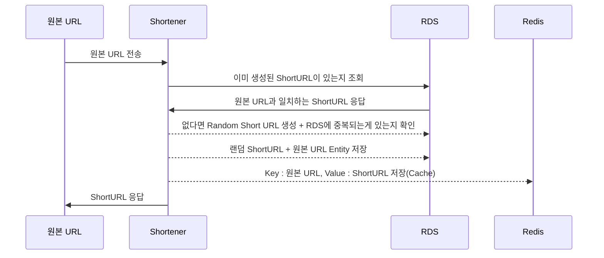
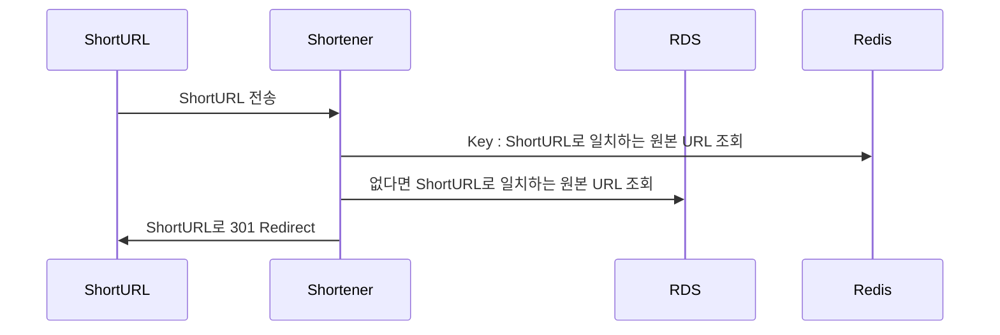

# 흐름도

## Create

```mermaid
sequenceDiagram
    participant user as 원본 URL
    participant shortener as Shortener
    participant rds as RDS
    participant redis as Redis
    user->>shortener: 원본 URL 전송
    shortener->>rds: 이미 생성된 ShortURL이 있는지 조회
    rds->>shortener: 원본 URL과 일치하는 ShortURL 응답
    shortener-->>rds: 없다면 Random Short URL 생성 + RDS에 중복되는게 있는지 확인
    shortener-->>rds: 랜덤 ShortURL + 원본 URL Entity 저장
    shortener-->>redis: Key : 원본 URL, Value : ShortURL 저장(Cache)
    shortener->>user: ShortURL 응답
```

## Read

```mermaid
sequenceDiagram
    participant user as ShortURL
    participant shortener as Shortener
    participant rds as RDS
    participant redis as Redis
    user->>shortener: ShortURL 전송
    shortener->>redis: Key : ShortURL로 일치하는 원본 URL 조회
    shortener->>rds: 없다면 ShortURL로 일치하는 원본 URL 조회
    shortener->>user: ShortURL로 301 Redirect
```
